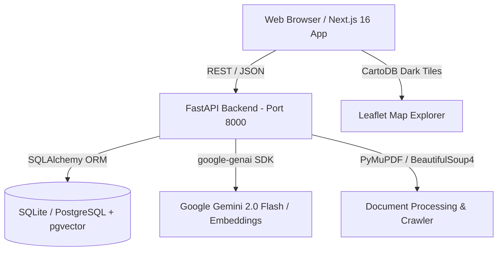

# 🧊 Polar Knowledge Hub

> **Integrated Polar Science Outreach, Knowledge Repository and Media Dissemination Portal**  
> **Smart India Hackathon (SIH) 2026** · **Problem Statement ID: 26063**  
> **Ministry:** Ministry of Earth Sciences (MoES)  
> **Organization:** National Centre for Polar and Ocean Research (NCPOR), Goa, India  
> **Theme:** Smart Education · **Category:** Software

---

## 🌟 Tagline
> **“Discover. Understand. Explore the Poles.”**

The **Polar Knowledge Hub** is an AI-powered scientific knowledge, education, research discovery, and media outreach platform that centralizes NCPOR's institutional intelligence and transforms decades of Indian polar expeditions into an accessible, searchable, and interactive digital experience.

---

## 🚀 Key Features

### 1. 🔍 Unified Search & Discovery Engine
- **Hybrid Search**: Combines full-text keyword retrieval with semantic dense vector search (pgvector / Gemini embeddings).
- **Rich Filtering**: Filter by research domain (Oceanography, Glaciology, Atmospheric Sciences, Biology), region (Antarctica, Arctic, Southern Ocean, Himalayas), document type, and expedition year.
- **Direct Access**: Preview and download expedition reports, scientific papers, research datasets, and high-resolution media.

### 2. 🤖 Polar AI Assistant (RAG with Citations)
- **Grounded Responses**: Powered by Gemini 2.0 Flash with retrieval-augmented generation (RAG) strictly grounded in NCPOR documents.
- **Interactive Citations**: Clickable source cards displaying exact document title, page number, and matched chunk text.
- **Curated Prompt Suggestions**: Pre-built questions about Bharati, Maitri, Himadri, and recent Indian Antarctic Expeditions.

### 3. ✨ Automated Outreach & Content Studio
- **Multi-Format Transformation**: Instantly convert heavy technical papers and expedition logs into:
  - 📄 150-word scientific executive summaries
  - 📰 500-word public science articles
  - 🎒 Student-friendly explanations with intuitive analogies (Grades 8–10)
  - 💼 Professional LinkedIn updates with hashtags
  - 🧵 Twitter/X threads (< 280 chars per tweet)
  - 📸 Instagram captions with high-engagement hashtags
  - 🎬 YouTube titles, video descriptions, and tags
  - ❓ Interactive 5-question multiple-choice quizzes with explanations
- **Human-in-the-Loop Moderation**: Review, edit, approve, or reject AI-generated drafts before publication.

### 4. 🗺️ Interactive Polar Map & Station Explorer
- **Interactive Cartography**: Dark-mode Leaflet map showcasing India's permanent polar stations:
  - **Antarctica**: Bharati (Larsemann Hills), Maitri (Schirmacher Oasis), Dakshin Gangotri (Historical)
  - **Arctic**: Himadri (Ny-Ålesund, Svalbard), IndARC (Underwater Mooring)
  - **Himalayas / Third Pole**: Himansh (Spiti Valley, Himachal Pradesh)
- **Live Details Drawer**: Year established, coordinates, active research domains, linked publications, datasets, and media gallery.

### 5. 🎓 Polar Classroom & Educational Hub
- **Interactive Learning Modules**: Curated topics covering Polar Ice Sheets, Indian Stations, Antarctic Marine Ecology, and Climate Proxies.
- **Knowledge Quizzes**: Built-in self-assessment quizzes with score calculation and explanatory answers.

### 6. ⚙️ Ingestion Engine & Admin Portal
- **Document Ingestion**: Drag-and-drop PDF/DOCX processing, text extraction with PyMuPDF, chunking, and automated metadata tagging.
- **Web Crawler**: Built-in scraper for NCPOR archives (`ncpor.res.in`, `ncaor.gov.in`).
- **Admin Dashboard**: Real-time stats on documents, media, datasets, and editorial queue.

---

## 🏗️ System Architecture



- **Frontend**: Next.js 16 (Turbopack, App Router, React 19), Tailwind CSS v4, Lucide Icons, Leaflet.js
- **Backend**: FastAPI, Python 3.10+, SQLAlchemy, Pydantic v2, PyMuPDF, BeautifulSoup4
- **AI / Embeddings**: Google Gemini 2.0 Flash (`google-genai` SDK) + fallback intelligent demo synthesis
- **Database**: Zero-config SQLite out-of-the-box (or PostgreSQL with `pgvector` for production)

---

## ⚡ Quickstart (One Command)

To start both the FastAPI backend and Next.js frontend concurrently:

```bash
chmod +x start.sh
./start.sh
```

The script will automatically:
1. Verify Node.js and Python 3 prerequisites.
2. Initialize virtualenv and install dependencies.
3. Seed the database with authentic NCPOR expeditions, stations, and sample documents.
4. Launch the FastAPI API on `http://localhost:8000` and Next.js on `http://localhost:3000`.

---

## 🛠️ Manual Setup

### 1. Backend (FastAPI)
```bash
cd apps/api
python3 -m venv .venv
source .venv/bin/activate
pip install -r requirements.txt
cp .env.example .env
# Optional: Add your GEMINI_API_KEY in .env for real-time generative responses
python3 ../../scripts/seed_database.py
uvicorn main:app --reload --port 8000
```

### 2. Frontend (Next.js)
```bash
cd apps/web
npm install
npm run dev
```

Visit [http://localhost:3000](http://localhost:3000) in your browser.

---

## 🔑 Demo Credentials

| Role | Email | Password |
|---|---|---|
| **Admin** | `admin@ncpor.res.in` | `PolarHub@2026` |
| **Scientist / Researcher** | `scientist@ncpor.res.in` | `PolarHub@2026` |
| **Outreach / Educator** | `outreach@ncpor.res.in` | `PolarHub@2026` |

---

## 📁 Repository Structure

```
├── apps/
│   ├── api/                     # FastAPI backend
│   │   ├── main.py              # REST API endpoints & routes
│   │   ├── models.py            # SQLAlchemy database models
│   │   ├── database.py          # Session & connection management
│   │   ├── ai_service.py        # Gemini 2.0 Flash & RAG pipeline
│   │   ├── crawler.py           # Web scraper & document ingestor
│   │   └── config.py            # Pydantic environment settings
│   └── web/                     # Next.js 16 frontend
│       └── src/
│           ├── app/             # App router pages (Repository, Explore, Assistant, Studio, Classroom, Admin)
│           ├── components/      # UI components (PolarMap, Navigation, Footer)
│           └── lib/             # API client & auth state stores
├── scripts/
│   └── seed_database.py         # Seed script with NCPOR historical data
├── start.sh                     # Automated dev server launcher
└── README.md                    # Project documentation
```

---

## 📜 License
Developed for the **Smart India Hackathon (SIH) 2026** under the auspices of the **Ministry of Earth Sciences (MoES)** and **National Centre for Polar and Ocean Research (NCPOR)**.
