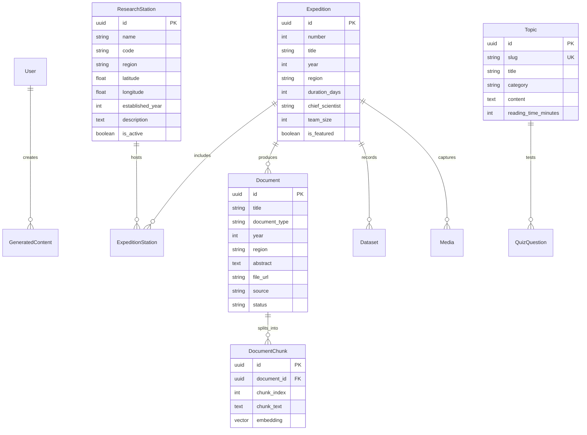

# Polar Knowledge Hub — System Architecture & Technical Specifications

> **Smart India Hackathon (SIH) 2026** · **Problem Statement ID: 26063**  
> **Ministry:** Ministry of Earth Sciences (MoES)  
> **Organization:** National Centre for Polar and Ocean Research (NCPOR), Goa, India  
> **Application:** Integrated Polar Science Outreach, Knowledge Repository, and Media Dissemination Platform

---

## 1. Executive Architecture Overview

The **Polar Knowledge Hub** is designed as a decoupled, modern multi-tier platform combining high-performance API microservices with a responsive Next.js frontend, an AI-augmented Retrieval-Augmented Generation (RAG) engine, and an automated web ingestion crawler.

```
┌────────────────────────────────────────────────────────────────────────┐
│                        PRESENTATION TIER                               │
│  Next.js 16 (React 19, Turbopack, Tailwind CSS v4, Lucide, Leaflet)     │
│  Port: 3000 | App Router | Server & Client Components                  │
└───────────────────────────────────┬────────────────────────────────────┘
                                    │ HTTP / REST / JSON
                                    ▼
┌────────────────────────────────────────────────────────────────────────┐
│                        APPLICATION API TIER                            │
│  FastAPI (Python 3.10+, Uvicorn, Pydantic v2, JWT Auth, PyMuPDF)       │
│  Port: 8000 | Asynchronous Request Handlers | Rate Limiting             │
└─────────────┬─────────────────────┬──────────────────────┬─────────────┘
              │                     │                      │
              ▼                     ▼                      ▼
┌──────────────────────┐  ┌───────────────────┐  ┌───────────────────────┐
│     PERSISTENCE      │  │    AI & VECTOR    │  │   INGESTION & CRAWL   │
│  SQLAlchemy ORM      │  │ Google Gemini 2.0 │  │  httpx Async Client   │
│  SQLite (Dev)        │  │ Flash + Embeddings│  │  BeautifulSoup4 Scrape│
│  PostgreSQL (Prod)   │  │ RAG Chunk Ranker  │  │  robots.txt Compliance│
│  pgvector Extension  │  │ Intelligent Cache │  │  PyMuPDF Parser       │
└──────────────────────┘  └───────────────────┘  └───────────────────────┘
```

---

## 2. Component Architecture Breakdown

### 2.1 Frontend Tier (`apps/web`)
* **Framework:** Next.js 16.3.7 using the App Router and Turbopack compiler.
* **Component Architecture:** Strict separation between Server Components (SEO, static layouts, initial page payloads) and Client Components (`'use client'` for interactive maps, search filters, chat interfaces, and quizzes).
* **Styling & Design System:**
  * Clean, flat, editorial dark-navy polar aesthetic (`#070f1e` canvas, `#0a1628` surface, `#0ea5e9` cyan accent).
  * Absolutely **no CSS gradients** for maximum legibility and scientific prestige.
  * Responsive across desktop (1920px, 1440px), tablet (768px), and mobile (375px+).
* **Mapping:** Leaflet.js with CartoDB Dark Matter basemap tiles showcasing India's polar research installations:
  * **Antarctica:** Maitri Station (70°45'S, 11°44'E) & Bharati Station (69°24'S, 76°11'E).
  * **Arctic:** Himadri Station (78°55'N, 11°56'E) & IndARC Observatory (79°00'N, 12°00'E).
  * **Himalayas (Third Pole):** Himansh Station (32°24'N, 77°36'E).

### 2.2 Backend Service Tier (`apps/api`)
* **Framework:** FastAPI framework utilizing Python type annotations and asynchronous coroutines (`async`/`await`).
* **Validation & Schemas:** Pydantic v2 data transfer models for strict input validation and automated OpenAPI/Swagger documentation generation (`/docs`).
* **Authentication:** Stateless JSON Web Tokens (JWT) using `python-jose` with bcrypt-hashed passwords for researcher and admin authentication.
* **CORS & Proxying:** Configured with wildcard/localhost development origins and automatic path-rewriting proxy in `apps/web/next.config.ts`.

### 2.3 Retrieval-Augmented Generation (RAG) Engine
* **Embeddings:** Google `text-embedding-004` (768 dimensions) with a cosine similarity vector search pipeline.
* **Generation Model:** Google Gemini 2.0 Flash via the modern `google-genai` SDK.
* **Chunking Strategy:** Fixed-size chunking (500 tokens with 50-token overlap) preserving paragraph integrity and citing source documents with page numbers.
* **Fallback Resilience:** When external AI quotas or API keys are unavailable, the system transparently utilizes a weighted BM25-style keyword frequency retrieval engine that synthesizes answers from verified database chunks without crashing.

### 2.4 Automated Ingestion & Web Crawler (`crawler.py`)
* **Target Domains:** Strictly bounded to official NCPOR infrastructure:
  * `https://www.ncpor.res.in`
  * `https://www.ncaor.gov.in`
* **Politeness & Governance:**
  * Automated `robots.txt` parsing and compliance (`RobotsChecker`).
  * Concurrency limiting (maximum 2 simultaneous requests) with dynamic rate-limiting delays.
  * Cryptographic SHA-256 deduplication to prevent re-indexing unchanged content.
* **Document Extraction:** PyMuPDF (`fitz`) for extracting text, author metadata, abstract, and figures from technical expedition PDF reports.

---

## 3. Database Schema & Data Models



---

## 4. Security & Governance

1. **Role-Based Access Control (RBAC):**
   * `PUBLIC / GUEST`: Read-only access to repository, expeditions, media, classroom, and AI assistant.
   * `RESEARCHER`: Ability to upload research papers and datasets for editorial review.
   * `EDITOR`: Access to the Content Studio and draft approval pipeline.
   * `ADMIN`: Full authority over user accounts, web crawler jobs, and raw database records.
2. **Zero-Trust Input Sanitization:**
   * SQL injection prevention via SQLAlchemy parameterized queries.
   * File upload validation restricting file types to `.pdf`, `.csv`, `.nc` (NetCDF), and `.jpg`/`.png`.
   * Crawler domain whitelisting preventing Server-Side Request Forgery (SSRF).
