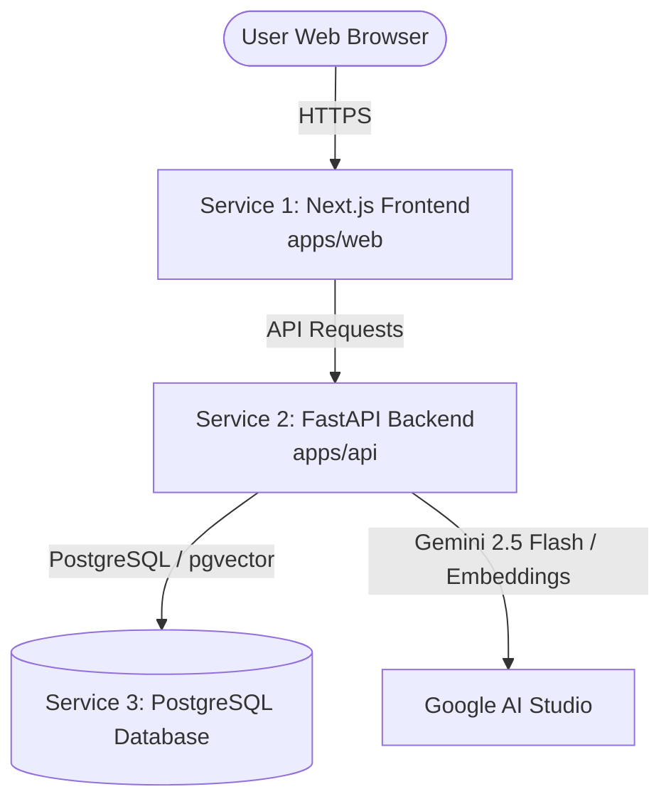

# Deploying Polar Knowledge Hub on Railway

This guide walks you through deploying the complete **Polar Knowledge Hub** on [Railway](https://railway.com/) with zero hassle.

---

## Architecture Overview

Railway allows you to deploy both services from the **same GitHub repository** inside a single Railway project.

---

## Step 1: Create a Railway Project & Add Database

1. Go to [railway.com](https://railway.com/) and sign in with GitHub.
2. Click **"+ New Project"**.
3. Select **"Provision PostgreSQL"** (or click **"Empty Project"** and click **"+ Create" -> "Database" -> "PostgreSQL"**).
4. *Railway will instantly provision a cloud PostgreSQL database.*

---

## Step 2: Deploy the Backend API (`apps/api`)

1. In your Railway project canvas, click **"+ Create"** -> **"GitHub Repo"**.
2. Select your repository: `abhayverma91104/polar-knowledge-hub`.
3. Click on the created service card and open **"Settings"**:
   - **Service Name**: Change to `polar-api`
   - **Root Directory**: Set to `/apps/api`
   - **Build Command**: Leave default (auto-detects Dockerfile or Python)
   - **Start Command**: `uvicorn main:app --host 0.0.0.0 --port $PORT`
4. Open the **"Variables"** tab and add the following environment variables:

| Variable | Recommended Value | Note |
| :--- | :--- | :--- |
| `DATABASE_URL` | `${{Postgres.DATABASE_URL}}` | *Railway auto-fills this reference from your PostgreSQL service* |
| `GEMINI_API_KEY` | `AIzaSy...` | *Your Google AI Studio Gemini API Key* |
| `SECRET_KEY` | `super-secret-jwt-key-for-polar-hub-2026` | *Any secure 32+ character random string* |
| `APP_ENV` | `production` | Production mode |
| `DEMO_MODE` | `false` | Enables live Gemini & embeddings |
| `CORS_ORIGINS` | `*` | Or your frontend domain |

5. In **"Settings"** -> **"Networking"**, click **"Generate Domain"**.
   - You will receive a URL like: `https://polar-api-production-xxxx.up.railway.app`.
   - **Copy this URL** (you need it in Step 3).

> **Automatic Seeding:** On startup, the backend automatically detects if the database is fresh and seeds all authentic NCPOR research stations, expeditions, publications, and admin credentials!

---

## Step 3: Deploy the Frontend Web (`apps/web`)

1. In the same Railway project canvas, click **"+ Create"** -> **"GitHub Repo"** -> select `polar-knowledge-hub` again.
2. Click on the new service card and open **"Settings"**:
   - **Service Name**: Change to `polar-web`
   - **Root Directory**: Set to `/apps/web`
   - **Build Command**: `npm run build`
   - **Start Command**: `npm start`
3. Open the **"Variables"** tab and add:

| Variable | Value | Note |
| :--- | :--- | :--- |
| `NEXT_PUBLIC_API_URL` | `https://polar-api-production-xxxx.up.railway.app` | *The exact backend URL from Step 2 (no trailing slash)* |

4. In **"Settings"** -> **"Networking"**, click **"Generate Domain"**.
   - You will receive your public frontend URL (e.g., `https://polar-web-production-xxxx.up.railway.app`).

---

## Step 4: Verify Deployment

1. Open your frontend Railway URL in your browser:
   - Check the **Homepage**: `Powered by Google Gemini` badge should be active.
   - Check **[Polar AI Assistant](/assistant)**: Should display `● Gemini Connected (gemini-flash-lite-latest)`. Ask a question about Bharati or Maitri Station.
   - Check **[Content Studio](/content-studio)**: Select a document and generate an outreach article or summary.
   - Check **[Explore Map](/explore)** and **[Repository](/repository)**: Authentic NCPOR stations and documents should appear.
2. Log in with the pre-seeded admin credentials:
   - **Email:** `admin@ncpor.res.in`
   - **Password:** `PolarHub@2026`

---

## Troubleshooting & Tips

* **CORS Errors:**  
  The backend already includes a permissive regex for `*.railway.app` and `*.up.railway.app`. If using a custom domain (e.g. `polar.yourdomain.com`), add `FRONTEND_URL=https://polar.yourdomain.com` in the backend service variables.
* **Persistent SQLite Alternative:**  
  If you do not want to use PostgreSQL, you can use SQLite by adding a Railway Volume mounted to `/app` with `DATABASE_URL=sqlite:///./polar_hub.db`. PostgreSQL is recommended for production.
* **Continuous Deployment:**  
  Any `git push origin main` will automatically trigger zero-downtime rolling deploys on Railway for both services.
